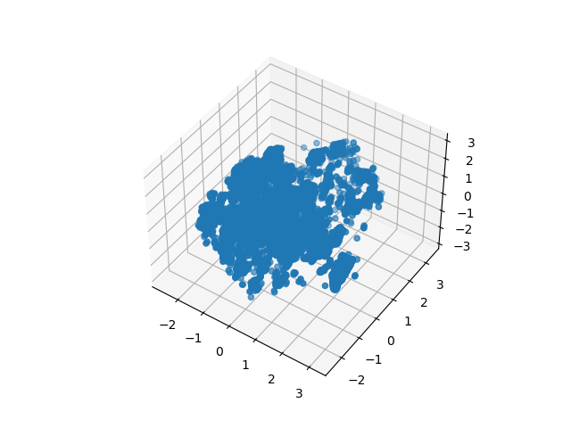
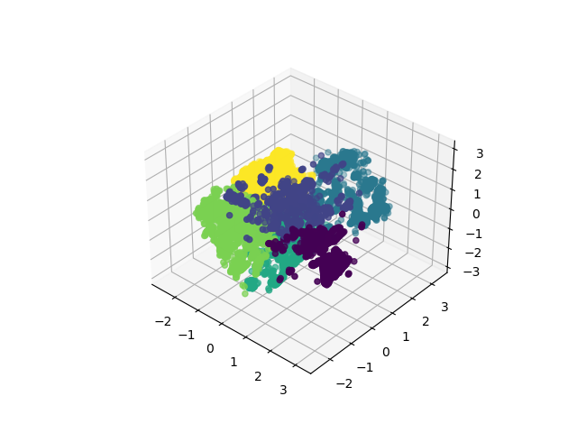
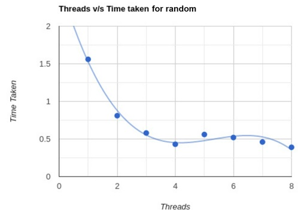
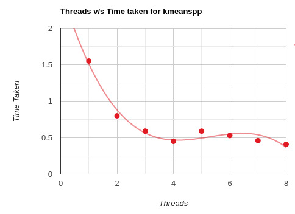

# Parallel_Computing

# KMeans

This repository contains a C++ implementation of the K-Means clustering algorithm parallelized using OpenMP. K-Means is a popular unsupervised machine learning algorithm used for clustering data points into a predefined number of clusters. Parallelizing the algorithm using OpenMP allows for significant speedup on multi-core processors. We try to use kmeans to cluster cells for spatial transcriptomics. The dataset can be found in Kaggle at this link: https://www.kaggle.com/datasets/rupindersinghrana/cell-clustering-for-spatial-transcriptomics

# Getting Started

## Prerequisites
This implementation requires the following dependencies:

* C++ compiler with OpenMP support (e.g., g++)
* The OpenMP library

## Compilation
1. Clone this repository to your local machine.
2. Navigate to the repository's directory.
3. Run `g++ main.cpp -o kmean -fopenmp -march=native`

## Usage

### Input

The algorithm takes as input a csv file containing one observation in each row. The feature must be separated by commas.

### Running the Program

To run use <code> ./kmean <dataset_file_name> <number_of_clusters> <thread_number> <algorithm_type> </code>

- <code><dataset_file_name></code> path of the dataset as a csv file
- <code><number_of_clusters></code> number of clusters
- <code><thread_number></code> number of thread to be used
- <code> <algorithm_type></code>  can be: _rand_ or _pp_ for random or kmeans pp initializer respectivly

For example:
`./kmean /data/Final_data.csv 6 16 rand`

### Generate datasets

The dataset_gen.py module allows the user to create custom datasets and visualize the result of the kmeans algorithm. To use run `python3 dataset_gen.py`and follow the instructions.

# Results
The result of the kmean algorithm is shown below

Raw Data                   |  After kmeans
:-------------------------:|:-------------------------:
   |  

The comparison of time taken vs number of threads is shown below:

Random initializer                  |  Kmeanspp initializer
:-------------------------:|:-------------------------:
   |  

